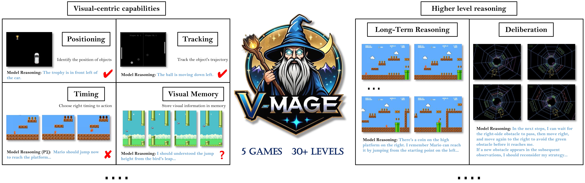

*link:* [*CSU-JPG V-MAGE Repo*](https://github.com/CSU-JPG/V-MAGE)
---
<br>
<br>

# V-MAGE: A Game Evaluation Framework for Assessing Visual-Centric Capabilities in MLLMs





<p align="center">
   <a href="https://csu-jpg.github.io/V-MAGE/" target="_blank">🌐 Project Page</a> | <a href="" target="_blank">📃 Paper </a> | <a href="" target="_blank">🤗 Playground </a> 
</p>


## ✨ Introducing **V-MAGE Benchmark**

V-MAGE is a **game-based** benchmark designed to evaluate **visual-centric** capabilities through **flexible gameplay** and **carefully designed levels**. Its defining features are as follows:
  
- **Visual-Centric**: Models receive only visual input, requiring pixel-level scene understanding, object tracking, and spatial-temporal reasoning.
- **Flexible Gameplay**: Unlike grid-based benchmarks, V-MAGE features continuous-space environments, allowing models to explore a almost infinite state space with no single correct solution.
- **Granular Skill Assessment**: Each game are deigned with different difficulty levels that targeting various skill dimensions.
- **Extensible Evaluation Framework**: V-MAGE extends beyond model evaluation to assess agentic skills that is current out-of-scope for SOTA MLLMs
- **Adaptive ELO-based Ranking**: V-MAGE uses a dynamic Elo system for performance comparison, avoiding manual score normalization and performance ceilings.


## 📈 Leaderboard 

| model | avg_elo | race | supermario | pong | flappybird | tempestrun |
| --- | --- | --- | --- | --- | --- | --- |
| gpt4o | **1550.83** | **1605.57** | 1536.58 | 1506.19 | **1590.23** | 1515.60 |
| qwen2_5vl_72b | 1543.85 | 1546.67 | **1608.86**| 1496.32 | 1535.53 | 1531.89 |
| gemini-2.0-flash-exp | 1522.82 | 1519.88 | 1536.84 | **1516.51** | 1524.91 | 1515.96 |
| internvl2_5_78b | 1512.60 | 1468.74 | 1573.56 | 1512.72 | 1497.01 | 1510.96 |
| qwen2vl_72b | 1506.49 | 1509.68 | 1535.26 | 1498.65 | 1455.87 | **1532.99** |
| internvl2_5_8b | 1466.12 | 1464.91 | 1393.19 | 1505.23 | 1489.18 | 1478.11 |
| random | 1450.53 | 1445.54 | 1436.00 | 1487.91 | 1457.36 | 1425.84 |
| qwen2vl_7b | 1446.75 | 1439.01 | 1379.71 | 1476.48 | 1449.90 | 1488.66 |

[Submit](https://github.com/fengxin-zhxx/V-MAGE-Results) your own agent results.

## 🚀 Quick Start

<!-- 启动Evaluation -->
To evaluate model with V-MAGE, you can use the following steps:

### Step 1: Dependencies Installation

Dependencies can be installed via pip:

```bash
cd V-MAGE
conda create -n v-mage python=3.10 -y
conda activate v-mage
pip install -r requirements.txt
```

<!-- 准备模型服务 -->
### Step 2: Model Service

<!-- 如果使用API服务，可以跳过此步骤 -->

**If you are using existing api service, you can skip this step.**

<!-- 我们推荐使用 vLLM 部署 Openai 接口的服务， -->
Otherwise, we recommend using [vLLM](https://github.com/vllm-project/vllm) or [SWIFT](https://github.com/modelscope/ms-swift) to deploy the OpenAI interface service for your local model.


Take vLLM and [Qwen2.5VL-7B Instruct](https://huggingface.co/Qwen/Qwen2.5-VL-7B-Instruct) as an example, you can start the service by running the following command:


```bash
# Download the model. 
# Remember to replace <path-to-model> with the path where you want to save the model.
pip install -U huggingface_hub
huggingface-cli download --resume-download Qwen/Qwen2.5-VL-7B-Instruct --local-dir <path-to-model>

# Start the service. You can change the parameters according to your needs.
pip install vllm
vllm serve <path-to-model> --trust-remote-code --max-model-len 15000 --limit-mm-per-prompt image=6 --port 8000 --gpu-memory-utilization 0.90 --tensor-parallel-size 2

```

You can also use *nohup* to run the service in the background.

### Step3: Config Preparation

Prepare config file for the model service. 

For example, if you are using vLLM, you can simply change the `model_path` and `openai_api_base` in the `config/model_config/openai_service_config.ini`.

```ini
[lmm]
model_name = OpenAI
model_path = <path-to-model>
openai_api_key = EMPTY
openai_api_base = http://localhost:8000/v1 # or your own service address
```

### Step 4: Let's Play!

#### runner.py: To evaluate a single level

```bash
python runner.py \
--llmProviderConfig=./config/model_config/openai_service_config.ini \
--gameEnvConfig=./config/env_config/env_config_race_reasoning_0steps.json \
--levelConfig=./config/level_config/racegame/level1_no_history.json \
--output_dir=runs/Qwen2_5VL_7B \
--test_rounds=10
```

#### multi_runner.py: To evaluate multiple levels

```bash
python multi_runner.py \
--config_file=./config/multi_runner_config/Race_3steps.json \
--llmProviderConfig=./config/model_config/openai_service_config.ini \
--output_dir=runs/Qwen2_5VL_7B \
--test_rounds=10
```

If you don't want to watch the game screen, you can set the environment variable `SDL_VIDEODRIVER` to `dummy` before running the script:

```bash
export SDL_VIDEODRIVER=dummy
```

## 📚 Documentation

### Other Model Providers

will be added soon

<!-- 拓展Agent -->
### Extending Your Own Agent

will be added soon

<!-- 接入新的游戏 -->
### Adding New Games

will be added soon


## 🔗 Others

### Game Codebases

Thanks to the open-source community, we are able to leverage existing game codebases to build our benchmark. Here are the games we used:

| Game  | Codebase |
| --- | --- |
| **RaceGame** | [tdostilio/Race_Game](https://github.com/tdostilio/Race_Game)
| **FlappyBird** | [agneay/pygame-projects/Flappy Bird](https://github.com/agneay/pygame-projects/tree/master/Flappy%20Bird)
| **Pong** | [pyGuru123/Python-Games/Pong](https://github.com/pyGuru123/Python-Games/tree/master/Pong)
| **SuperMario** | [mx0c/super-mario-python](https://github.com/mx0c/super-mario-python)
| **Tempest Run** | [daipenger/pygame-summer-team-jam](https://github.com/davidpendergast/pygame-summer-team-jam)


## 📜 Citation

```
will be added soon
```


