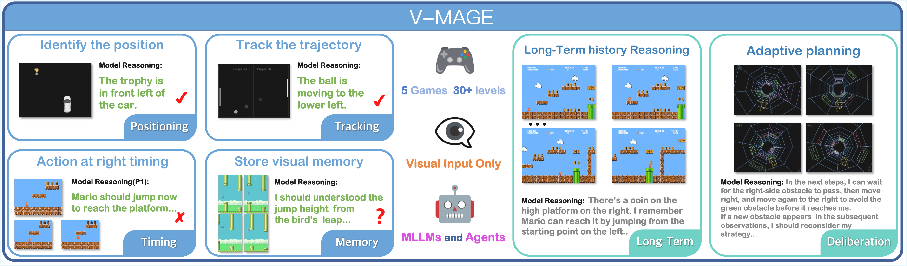

# [ACL '26 Findings] V-MAGE: A Game Evaluation Framework for Assessing Visual-Centric Capabilities in MLLMs





<p align="center">
   <a href="https://csu-jpg.github.io/V-MAGE/" target="_blank">🌐 Project Page</a> | <a href="https://arxiv.org/abs/2504.06148" target="_blank">📃 Paper </a> | <a href="https://huggingface.co/spaces/Fengx1nn/V-MAGE-Playground" target="_blank">🤗 Playground </a> | <a href="https://huggingface.co/spaces/Fengx1nn/V-MAGE-Evaluation" target="_blank">🤗 Evaluation </a>
</p>


## 📰 News

- **[2026.04.07]** 🎉 Our **CharTide** is accepted by **ACL 2026 Findings**！


## ✨ Introducing **V-MAGE Benchmark**

V-MAGE is a **game-based** benchmark designed to evaluate **visual-centric** capabilities through **flexible gameplay** and **carefully designed levels**. Its defining features are as follows:
  

- **Vision Centric Gameplay**: Models receive only visual input, requiring pixel-level scene understanding, object tracking, and spatial-temporal reasoning. V-MAGE features continuous-space environments, allowing models to explore the almost infinite state space. Each game is deigned with different difficulty levels that targeting various skill dimensions.
- **Extensible Evaluation Framework**: 
V-MAGE extends beyond model evaluation to assess agentic skills that are out-of-scope for current MLLMs. Our game-agent-model three-module evaluation pipeline allows optimizations in both MLLMs and their agent strategies.

- **Adaptive ELO-based Ranking**: 
V-MAGE uses a dynamic Elo system to provide a unified and interpretable metric across diverse games and difficulty levels. Unlike raw scores, which vary in scale across tasks, the Elo rating captures relative skill levels by modeling win–loss dynamics between model performances on shared levels. 


## 📈 Leaderboard

Performance comparison across different games based on the ELO ranking system. The Random baseline refers to randomly selecting actions from the predefined action space during decision-making phases. **Avg. Ratio** refers to the average percentage of the model's score compared to the human baseline score.

| Model                       | Flappybird | Pong     | Race     | Supermario | Tempestrun | Avg. ELO Score | Avg. Ratio (%) |
|-----------------------------|------------|----------|----------|------------|------------|----------------|----------------|
| **Closed-Source Models**    |            |          |          |            |            |                |                |
| GPT-5-2025-08-07            | 1572       | **1939** | **1710** | 1584       | **1743**   | **1710**       | **43.4**       |
| Gemini-2.5-Pro              | 1526       | 1602     | 1660     | **1758**   | 1474       | 1604           | 36.3           |
| Claude-3.7-Sonnet           | 1560       | 1570     | 1633     | 1582       | 1369       | 1543           | 30.8           |
| Gemini-2.5-Flash            | **1578**   | 1524     | 1520     | 1531       | 1489       | 1528           | 23.8           |
| GPT-4o                      | 1557       | 1449     | 1581     | 1518       | 1527       | 1526           | 26.6           |
| Gemini-2.0-Flash (Thinking) | 1517       | 1479     | 1503     | 1564       | 1516       | 1516           | 22.6           |
| GPT-5.1-2025-11-13          | 1552       | 1514     | 1507     | 1449       | 1411       | 1486           | 20.1           |
| Gemini-2.0-Flash            | 1494       | 1461     | 1437     | 1499       | 1530       | 1484           | 16.7           |
| **Open-Source Models**      |            |          |          |            |            |                |                |
| Qwen3-VL-235B-A22B-Instruct | 1567       | 1441     | 1517     | 1556       | 1496       | 1515           | 24.3           |
| Qwen2.5-VL-72B-Instruct     | 1556       | 1442     | 1506     | 1541       | 1530       | 1515           | 22.8           |
| InternVL2.5-78B             | 1463       | 1462     | 1465     | 1543       | 1528       | 1492           | 19.2           |
| Qwen2-VL-72B-Instruct       | 1426       | 1445     | 1442     | 1505       | 1547       | 1473           | 16.5           |
| InternVL2.5-8B              | 1459       | 1448     | 1431     | 1373       | 1495       | 1441           | 12.9           |
| Qwen2.5-VL-7B-Instruct      | 1457       | 1446     | 1423     | 1354       | 1517       | 1439           | 12.1           |
| Qwen2-VL-7B-Instruct        | 1470       | 1447     | 1408     | 1362       | 1501       | 1438           | 11.4           |
| Keye-VL-8B-Preview          | 1419       | 1444     | 1428     | 1381       | 1499       | 1434           | 13.1           |
| Phi-4-multimodal-instruct   | 1404       | 1454     | 1420     | 1482       | 1385       | 1429           | 13.7           |
| **Baseline**                |            |          |          |            |            |                |                |
| Random                      | 1422       | 1434     | 1410     | 1417       | 1445       | 1426           | 11.0           |

## 🚀 Quick Start

<!-- 启动Evaluation -->
To evaluate model with V-MAGE, you can use the following steps:

### Step 1: Dependencies Installation

Dependencies can be installed via pip:

```bash
cd V-MAGE
conda create -n v-mage python=3.10 -y
conda activate v-mage
pip install -r requirements.txt
```

<!-- 准备模型服务 -->
### Step 2: Model Service

<!-- 如果使用API服务，可以跳过此步骤 -->

**If you are using existing api service, you can skip this step.**

<!-- 我们推荐使用 vLLM 部署 Openai 接口的服务， -->
Otherwise, we recommend using [vLLM](https://github.com/vllm-project/vllm) or [SWIFT](https://github.com/modelscope/ms-swift) to deploy the OpenAI interface service for your local model.


Take vLLM and [Qwen2.5VL-7B Instruct](https://huggingface.co/Qwen/Qwen2.5-VL-7B-Instruct) as an example, you can start the service by running the following command:


```bash
# Download the model. 
# Remember to replace <path-to-model> with the path where you want to save the model.
pip install -U huggingface_hub
huggingface-cli download --resume-download Qwen/Qwen2.5-VL-7B-Instruct --local-dir <path-to-model>

# Start the service. You can change the parameters according to your needs.
pip install vllm
vllm serve <path-to-model> --trust-remote-code --max-model-len 15000 --limit-mm-per-prompt image=6 --port 8000 --gpu-memory-utilization 0.90 --tensor-parallel-size 2

```

You can also use *nohup* to run the service in the background.

### Step3: Config Preparation

Prepare config file for the model service. 

For example, if you are using vLLM, you can simply change the `model_path` and `openai_api_base` in the `config/model_config/openai_service_config.ini`.

```ini
[lmm]
model_name = OpenAI
model_path = <path-to-model>
openai_api_key = EMPTY
openai_api_base = http://localhost:8000/v1 # or your own service address
```

### Step 4: Let's Play!

#### runner.py: To evaluate a single level

```bash
python runner.py \
--llmProviderConfig=./config/model_config/openai_service_config.ini \
--gameEnvConfig=./config/env_config/0steps/env_config_race_reasoning_0steps.json \
--levelConfig=./config/level_config/racegame/level1_no_history.json \
--output_dir=runs/Qwen2_5VL_7B \
--test_rounds=10
```

#### multi_runner.py: To evaluate multiple levels

```bash
python multi_runner.py \
--config_file=./config/multi_runner_config/3steps/Race_3steps.json \
--llmProviderConfig=./config/model_config/openai_service_config.ini \
--output_dir=runs/Qwen2_5VL_7B \
--test_rounds=10
```

If you don't want to watch the game screen, you can set the environment variable `SDL_VIDEODRIVER` to `dummy` before running the script:

```bash
export SDL_VIDEODRIVER=dummy
```

## 🔗 Others

### Game Codebases

Thanks to the open-source community, we are able to leverage existing game codebases to build our benchmark. Here are the games we used:

| Game  | Codebase |
| --- | --- |
| **RaceGame** | [tdostilio/Race_Game](https://github.com/tdostilio/Race_Game)
| **FlappyBird** | [agneay/pygame-projects/Flappy Bird](https://github.com/agneay/pygame-projects/tree/master/Flappy%20Bird)
| **Pong** | [pyGuru123/Python-Games/Pong](https://github.com/pyGuru123/Python-Games/tree/master/Pong)
| **SuperMario** | [mx0c/super-mario-python](https://github.com/mx0c/super-mario-python)
| **Tempest Run** | [daipenger/pygame-summer-team-jam](https://github.com/davidpendergast/pygame-summer-team-jam)


## 📜 Citation

```
@article{zheng2025vmagebenchmark,
      title={V-MAGE: A Game Evaluation Framework for Assessing Visual-Centric Capabilities in Multimodal Large Language Models}, 
      author={Xiangxi Zheng and Linjie Li and Zhengyuan Yang and Ping Yu and Alex Jinpeng Wang and Rui Yan and Yuan Yao and Lijuan Wang},
      journal={arXiv preprint arXiv:2504.06148},
      year={2025},
}
```


